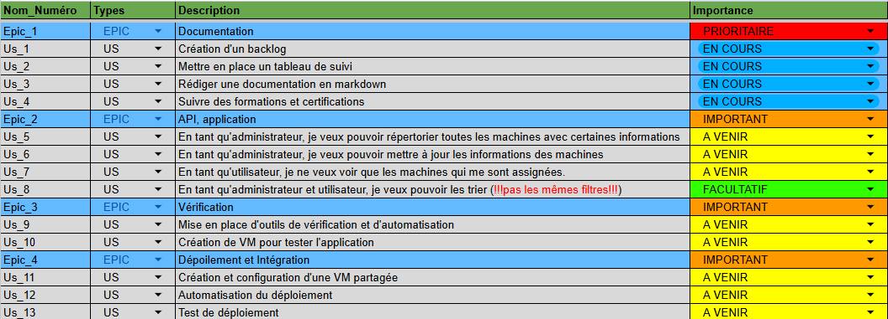
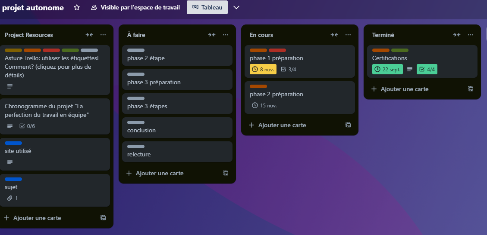

# Projet autonome DevCloud
## Sujet de projet :
Developpement Système et Cloud, Gestion de Projet, Déploiement et Intégration Continue
### Contexte :
Ce projet me permettra de développer des compétences e, développement systèmes et cloud, en couvrant des aspects clés tels que la gestion de projet agile, la configuration d'environnements de développement, et la mise en place de processus d'intégration continue.
Le projet est structuré en plusieurs phases, chacune nécessitant des livrables spécifiques et la rédaction d'une documentation destinée à faciliter la prise en main du projet par un nouveau contributeur.
Je développerait également une application exemple sous la forme d'un micro-service (API) orientée IT, qui servira de support pratique tout au long du projet.
# Répartition du projet
Phase 1 : Gestion de projet agile et documentation
   1. Définition du backlog
   2. Utilisation de trello pour répertorier les ressources, sites et documents utilisé ainsi que d'établir le plan de travail
   3. Explication de la documentation

Phase 2 : Développement de l'application exemple et mise en place de l'environnement de Développement
   1. Définition des spécifications de l'API (YAML)
   2. Développer l'API
   3. Initialiation de l'environnement Python
   4. Configuration de Git
   5. Mise en place de pre-commit
   6. Création de script vagrant

Phase 3 : Déploiement et intégration continue
   1. Création de la VM patargée
   2. Installation de Docker et la registry docker
   3. Création du dockerfile de l'API
   4. Automatisation du pipeline CI/CD
   5. Test de déploiement

# Phase 1
### Définition du backlog
#### Qu'est-ce qu'un **Backlog**?
- Voici le concept général d'un backlog :
  - Un backlog est une liste d'éléments ou de tâches à réaliser qui sont mise en priorité. Il représente le travail à faire pour un projet ou un produit. Il est souvent sous la formes de fonctionnalités, de corrections de bug ou bien d'autre exigences.
- Il existe deux types de backlogs : 
  - Le **Product Backlog** : correspond à la liste des fonctionnalités, amélioration et corrections que l'on veut faire au produit. Il doit-être régulièrement mis à jour suivant les retours des utilisateurs, des nouvelles idées et les changements de priorité.
  - Le **Sprint Backlog** : correspond à une sous-liste du **Product Backlog** qui contient les éléments sélectionnés pour être réaliser durant un sprint spécifique. Il inclut également les tâches nécessaires pour le développement de ces éléments.
#### L'importance du Backlog
- **Transparence** : Le backlog offre une visibilité sur le travail à accomplir, permettant à toutes les parties prenantes de comprendre les priorités et l'état d'avancement du projet.
- **Flexibilité** : Le backlog peut être ajusté à tout moment pour refléter les changements de priorités ou de besoins, ce qui est essentiel dans un environnement agile.
- **Planification** : Il aide les équipes à planifier leur travail de manière réaliste, en leur fournissant une feuille de route claire des tâches à accomplir.

Pour créer le backlog, je me suis aidé du site [blog-gestion-de-projet.com](https://blog-gestion-de-projet.com/) et de [poe.com](https://poe.com/).
Voic les étapes clés pour le créer :
1. Définition de l'objectif du backlog. C'est-à-dire, identifier le but, la durée de projet. Pour déterminer les types d'éléments à y inclure.
2. Rassembler les parties prenantes. Tout le monde y est inclu, les utilisateurs, les clients et les membres de l'équipe.
3. Identification des éléments à inclute. Lister toutes les fonctionnalités, améliorations, correction de bogues et d'autre exigences.
4. Rédaction des User stories. Ce mettre à la place d'une personne et dire les fonctionnalités qu'elle a.
5. Priorisation des éléments. Etablissement d'une hiérarchie 
6. Estimation des efforts. Evaluation du tempsx des ressources et des efforts pour réaliser chaque éléments.
7. Organisation du Backlog. Choix du produit utilisé ou de la base, application ou un simple tableau. Les éléments doivent être clairement identifiés et facile à comprendre.
8. Affinage du Backlog régulier. Pour ajuster les priorité, ajouter de nouveaux éléments et estimer ceux qui ne l'ont pas été. Cela pour que le Bakclog reste pertinent.
9. Communication. La partie importante, le partage à toutes les parties prenantes et s'assurer la bonne compréhension.
#### Construction du Backlog de ce projet
Voici donc à quoi ressemble le Backlog de ce projet :

Il est constitué de 4 **EPICS** qui sont eux constitué de **USER STORIES** comme sur l'image supérieur. Un **EPIC** représente une objetif pour l'utilisateur d'un point de vue macro, une **USER STORIES** décrit les exigences pour les fonctionnalités nécessaires: 
1. Documentation (EPIC)
   1. Création d'un backlog (USER STORIES) : Lecture du sujet et définition des besoins et spécifications pour le projet.
   2. Mettre en place un tableau de suivi : Création d'un trello pour suivre l'avancement du projet et fixé des dates limites.
   3. Rédiger une documentation en markdown : La documentation doit être accessible et facile à suivre pour tous les parties prenants et autre personne extérieurs au projet.
   4. Suivre des formations et certifications : Une phase formations sur les applications et sites à utiliser dans le projet ainsi que des certifications pour comprendre et savoir utiliser d'autre compétences.
2. API, application
   1. En tant qu'administrateur, je veux pouvoir répertorier toutes les machines avec certaines informations : Utilisation d'une API pour récupérer les toutes informations de toutes les machines pour le compte administrateur.
   2. En tant qu'administrateur, je veux pouvoir mettre à jour les informations des machines : Utilisation d'une API pour mettre à jour les informations des machines.
   3. En tant qu'utilisateur, je ne veux voir que les machines qui me sont assignées : Utilisation d'une API pour récupérer certaines informations des machines qui lui sont assignées.
   4. En tant qu'administrateur et utilisateur, je veux pouvoir les trier (!!!pas les mêmes filtres!!!) : Utilisation d'une API pour récupérer certaines informations des machines qui lui sont assignées et qui respectent certains filtres.
3. Vérification
   1. Mise en place d'outils de vérification et d'automatisation : Utilisation d'outils de vérification et d'automatisation pour tester les fonctionnalités de l'application.
   2. Création de VM pour tester l'application : Création d'une VM partagée pour tester l'application et vérifier les fonctionnalités.
4. Dépoilement et Intégration 
   1. Création et configuration d'une VM partagée : Création d'une VM partagée pour déployer l'application et vérifier les fonctionnalités.
   2. Automatisation du déploiement : Utilisation d'outils de CI/CD pour automatiser le déploiement de l'application.
   3. Test de déploiement

### Utilisation de trello pour répertorier les ressources, sites et documents utilisé ainsi que d'établir le plan de travail
J'ai utilisé Trello pour répertorier les ressources, sites et documents utilisés ainsi que d'établir le plan de travail. Voici, en image, à quoi ressemble le trello :  et voici le lien pour y accéder [trello.com](https://trello.com/invite/b/66d58460f25a074c62a46399/ATTI543ffb3c3eb33389026ff6ec6f4ab1d6069CF7A8/projet-autonome)